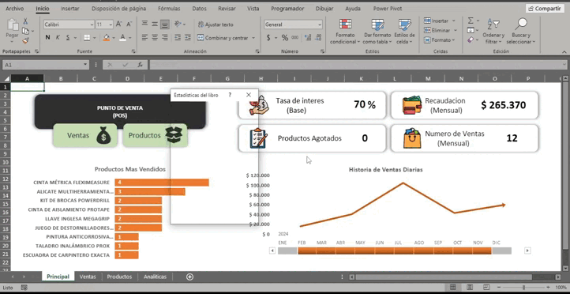

# ExcelPOS

Proyecto en Excel y BVA con formularios para la gestion de ventas y productos de un comercio
<a href="https://raw.githubusercontent.com/gonzaloaxx/excelpos/main/PuntoDeVenta-Demo.xlsm" title="Download">Descargar Archivo</a>

### Atribuciones de iconos usados
<a href="https://www.flaticon.com/free-icons/buy" title="buy icons">Buy icons created by Darius Dan - Flaticon</a>
<a href="https://www.flaticon.com/free-icons/money" title="money icons">Money icons created by Freepik - Flaticon</a>
<a href="https://www.flaticon.com/free-icons/tax" title="tax icons">Tax icons created by Freepik - Flaticon</a>
<a href="https://www.flaticon.com/free-icons/task" title="task icons">Task icons created by Freepik - Flaticon</a>
<a href="https://www.flaticon.com/free-icons/wallet" title="wallet icons">Wallet icons created by justicon - Flaticon</a>
<a href="https://www.flaticon.com/free-icons/box" title="box icons">Box icons created by Freepik - Flaticon</a>

## Aclaraciones
Los datos de productos, ventas y graficas son completamente ficticios con fines demostrativos
